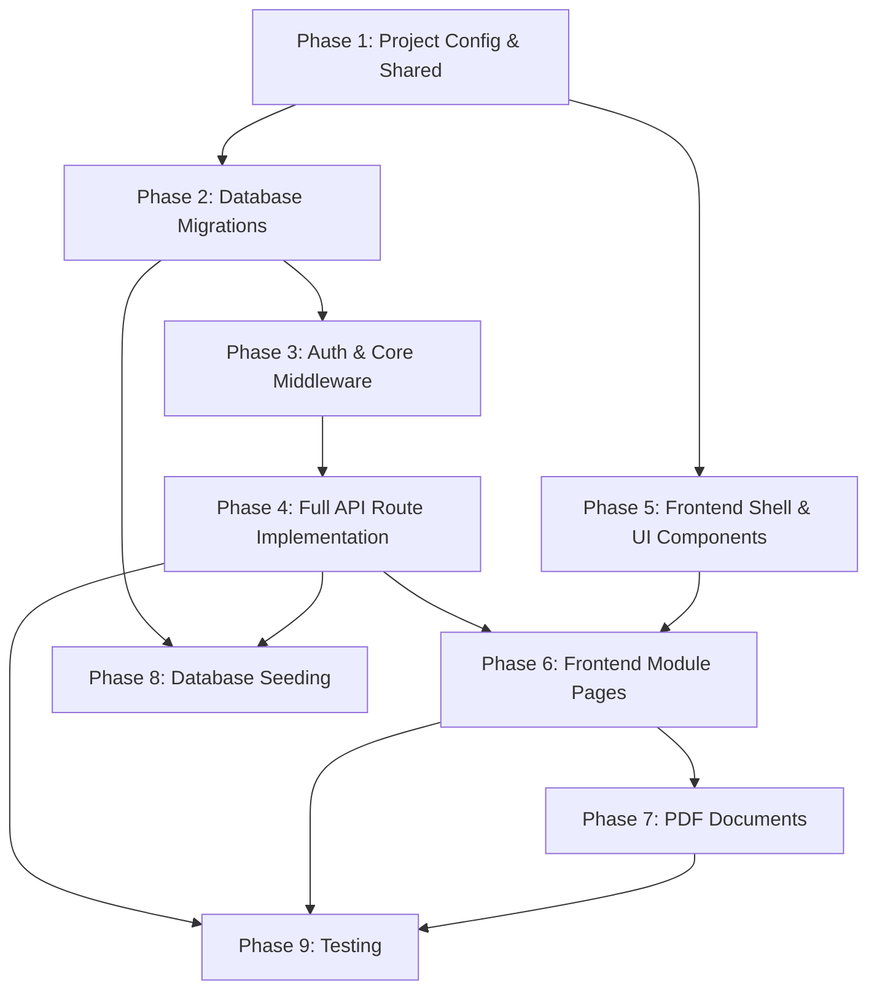

# Jaxtina HCM System Plan

## 1. Executive Summary
Jaxtina HCM is a comprehensive, production-grade Human Capital Management system designed for mid-size organizations scaling up to 2,000 employees. The platform centralizes critical HR operations encompassing employee profiles, organizational hierarchal mapping, payroll execution, recruitment pipelines, performance appraisals, leave management, and continuous learning. Built upon a robust monorepo architecture leveraging modern React, TypeScript, and a scalable Node.js/PostgreSQL backend, the application prioritizes performance, strict role-based security, and maintainability. It is packaged with standard integrations for client-side PDF document generation and is containerized via Docker for predictable E2E deployments.

## 2. Phase Dependency Graph

## 3. Per-Phase Narrative
*   **Phase 1: Project Config & Shared:** Establishes the monorepo foundation, setting up tooling and global typings. This ensures standard typing definitions for DB schemas and API contracts exist before client or server development begins.
*   **Phase 2: Database Migrations:** Defines the structural truth of the application. Establishing the Knex schema early allows backend controllers and frontend interfaces to solidify against an immovable data contract.
*   **Phase 3: Auth & Core Middleware:** Implements the JWT-based security mechanics alongside middleware (rate limiting, validation, RBAC checks). Sets permissions boundaries before the data routes are built.
*   **Phase 4: Full API Route Implementation:** Creates the programmatic backbone. Controllers and services are modularly constructed for all six major resource domains, exposing documented REST patterns.
*   **Phase 5: Frontend Shell & UI Components:** Builds out the "dumb" presentation layer, including layouts, generic inputs, Modals, and styling frameworks. Defers business logic but speeds up module velocity.
*   **Phase 6: Frontend Module Pages:** Wires TanStack query states into the API and maps reactive views (such as dnd-kit boards and xyflow org charts) fulfilling direct user narratives.
*   **Phase 7: PDF Documents:** Implements specific templates using `@react-pdf/renderer` rendering documents natively in the browser based on UI state.
*   **Phase 8: Database Seeding:** Critical step to populate realistic baseline context simulating mid-size company data constraints. Ensures demonstrations and testing contexts resemble production payload scales.
*   **Phase 9: Testing:** Shifts right to verify functional integration behavior under authenticated headers, and unit verifies pure computational paths.

## 4. Risk Register
1.  **Risk: Render Performance of Org Charts.**
    *   **Impact:** High
    *   **Likelihood:** Medium
    *   **Mitigation:** Use `@xyflow/react` efficiently with minimal node complexity and stable node keys. Avoid tracking deep reactive state per node, maintaining flat representations until render.
2.  **Risk: Token Exfiltration and XSS.**
    *   **Impact:** Critical
    *   **Likelihood:** Low
    *   **Mitigation:** Application state securely holds the short-lived JWT in memory (AuthContext), not localStorage. A `httpOnly` refresh token ensures session persistency free of JS-accessible leaks.
3.  **Risk: Temporal Logic Desync (Timezones).**
    *   **Impact:** High
    *   **Likelihood:** Medium
    *   **Mitigation:** Strict enforcement of UTC for all standard database columns. `COMPANY_TIMEZONE` utilized strictly at the controller-presentation boundary for specific calendar aggregations.
4.  **Risk: Race Conditions (Leave approvals/Pipeline transitions).**
    *   **Impact:** Medium
    *   **Likelihood:** Low
    *   **Mitigation:** Usage of explicit Knex transactions enveloping associated row reads and mutation logic, shielding aggregate counters like Leave Balances.
5.  **Risk: Over-engineering Component Abstractions.**
    *   **Impact:** Medium
    *   **Likelihood:** Medium
    *   **Mitigation:** Adhere stringently to the explicitly defined Shared Component library. Avoid inventing new variants mid-feature unless the shared component cannot fulfill the contract.

## 5. Tech Decision Log
*   **`@xyflow/react` & `@dnd-kit/core`:** Selected over vanilla D3/Drag-and-Drop due to React-first paradigms, which vastly simplify implementation velocity while retaining accessibility and canvas performance.
*   **Client-side PDF Generation (`@react-pdf/renderer`):** Selected to offload heavy stream processing and PDF matrix compilation to the client, keeping the backend CPU-free and minimizing binary payload transfers over the wire.
*   **JWT-in-memory architecture:** A compromise-free security decision leveraging `httpOnly` secure cookies for long-lived session renewal while mitigating common `localStorage` XSS vectors.
*   **Zod Middleware wrapper:** Prevents malformed data from ever touching the service layer, keeping API responses uniform and strongly typed.

## 6. Estimated File Count
*   Phase 1/Shared: 12
*   Phase 2 (Migrations): 7
*   Phase 3 (Auth/Core): 18
*   Phase 4 (API Modules): 45
*   Phase 5 (Frontend Core): 25
*   Phase 6 (Module Pages): 40
*   Phase 7 (PDFs): 3
*   Phase 8 (Seeds): 11
*   Phase 9 (Tests): 25
*   **Total Estimate:** ~186 files

## 7. Open Questions
*   **File Storage:** While the abstraction layer will support S3, local storage is the default. Do we need an automated cleanup cron for orphaned files during active development? (Assumption: No, out of scope for MVP).
*   **Performance Goals:** Does a Key Result update automatically recalculate and mutate its parent Goal's completion percentage locally, or via a PostgreSQL trigger? (Assumption: Conducted in the service layer transacting both rows).
*   **Payroll Currency:** Are we tracking historical FX rates, or purely displaying everything sequentially localized through `COMPANY_CURRENCY`? (Assumption: Flat universal display).
